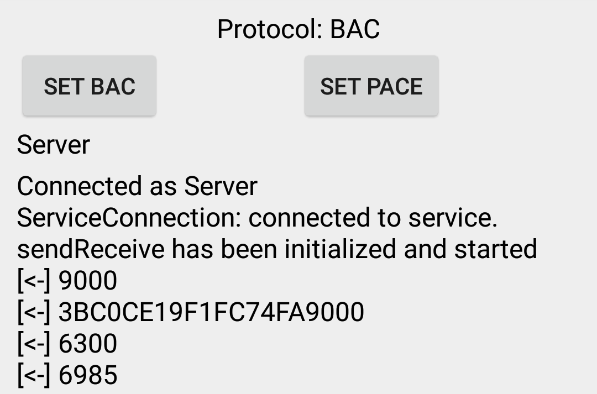

# Relay for BAC and PACE unlinkability attacks exploitation guide

## Summary

This repository contains a step-by-step explanation of how to reproduce BAC unlinkability attack described in [this repository](https://github.com/ZDSmith/bac-protocol-unlinkability) and additionally, the same sort of attack but targetting PACE protocol.

## Abreviations

PASSPORT READER - [https://github.com/bboyifeel/passport_reader](https://github.com/bboyifeel/passport_reader)
PASSPORT READER RELAY - [https://github.com/bboyifeel/passport_reader_relay](https://github.com/bboyifeel/passport_reader_relay)
PASSPORT EMULATOR RELAY - [https://github.com/bboyifeel/passport_emulator_relay](https://github.com/bboyifeel/passport_emulator_relay)

## Operation

For the operation, you have to have at least two phones with NFC support and honest e-passport reader (the third phone can be used as an honest reader, e.g PASSPORT READER). 

1. Build and deploy all three apps (PASSPORT READER RELAY, PASSPORT EMULATOR RELAY, PASSPORT READER) on different phones that support NFC.
2. Before running applications, make sure that NFC feature is turned on.
3. PASSPORT READER RELAY and PASSPORT EMULATOR RELAY first need to establish a WiFi peer-to-peer communication. Therefore, one should grant location permission by pressing "Allow" button and to turn on devices "Location". This step is required to enable peers discovery.

4. To establish a communication channel between fake reader and emulator, press the discover button on both devices and wait till device names show up in the list. Then select the pairing device on either of the phones. Right after you will be redirected to a new activity that displays logs. Before proceeding to the next step, make sure that the emulator has connected to the service (it will be written in on the screen), and both devices have "sendReceiver has been initialized and started". If anything is missing, restart WiFi connectivity on both devices, delete apps from the memory and restart applications (PASSPORT READER RELAY and PASSPORT EMULATOR RELAY) again.
5. System of application can attack both BAC and PACE. In order to target BAC, press "SET BAC" or "SET PACE" respectively on both devices (PASSPORT READER RELAY and PASSPORT EMULATOR RELAY).
6. To demonstrate an attack, type in can number of the document in the legitimate reader (PASSPORT READER). Then randomly chose a document to be tested and apply fake passport reader to it. It first requests whether chip implements any Supplementary protocols and if it is, then signal emulator with a OK\_RAPDU ("9000").
7. Once the emulator has received OK\_RAPDU, it can be used to replay communication.
8. Withing couple of seconds, the protocol execution will be replayed and the fake reader will be able to determine whether it is the same document or not.

Example of the BAC relay unlinkability attack execution with the same passport:

Example of the BAC relay unlinkability attack execution with different passport:

Example of the PACE relay unlinkability attack execution with the same passport:

Example of the PACE relay unlinkability attack execution with different passport:

